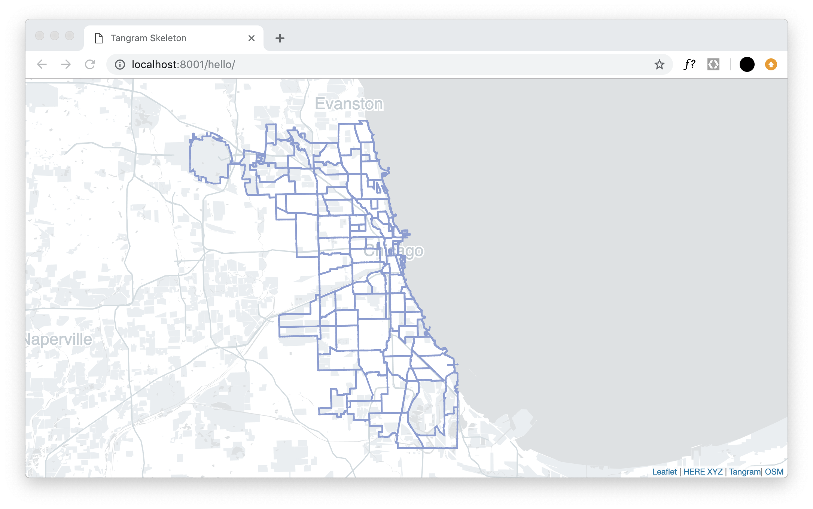

# Tangram Make

A command-line tool to quickly generate a Tangram/Leaflet with data displayed from an XYZ Space.

To use this tool, please execute with `npx` so the package files will be deleted once execution finishes.

## Usage

```
npx tangram-make {name of directory to make} {xyz space id} {xyz token}
```

A sample command could look like:
```
npx tangram-make chicago-neighborhoods 6k5s32ms 23hlasdkj38qjapd
```

This will generate:
- an html file for creating a Leaflet/Tangram map
- a CSS file with relevant styling
- a JavaScript file to initialize the map
- a YAML file with the Tangram map scene


